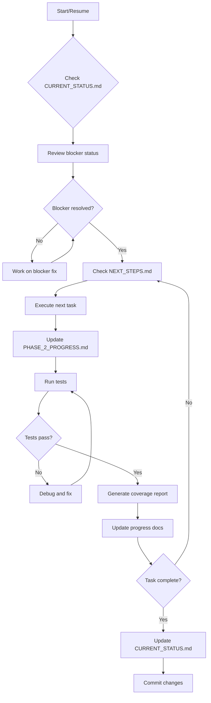

# Documentation Index

This directory contains all project documentation, progress tracking, and implementation guides.

---

## 🚀 Quick Start

**To continue development from saved state:**
```
"please continue with the implementation"
```

**Current Focus**: Phase 2 - Test Coverage Implementation (19% complete)

---

## 📚 Document Overview

### 🎯 Active Development Docs

| Document | Purpose | Use When |
|----------|---------|----------|
| **[CURRENT_STATUS.md](./CURRENT_STATUS.md)** | Current work state, blockers, exact next steps | Resuming work after break |
| **[NEXT_STEPS.md](./NEXT_STEPS.md)** | Quick reference for immediate actions | Need quick reminder of what to do next |
| **[PHASE_2_PROGRESS.md](./PHASE_2_PROGRESS.md)** | Detailed Phase 2 task breakdown and progress | Checking task status and coverage metrics |
| **[TEST_IMPLEMENTATION_GUIDE.md](./TEST_IMPLEMENTATION_GUIDE.md)** | Complete testing guide with patterns and examples | Implementing new tests |

### 📊 Project Planning Docs

| Document | Purpose |
|----------|---------|
| **[PROJECT_AUDIT.md](./PROJECT_AUDIT.md)** | Comprehensive project analysis and findings |
| **[IMPLEMENTATION_PLAN.md](./IMPLEMENTATION_PLAN.md)** | 8-phase implementation roadmap |
| **[SESSION_SUMMARY.md](./SESSION_SUMMARY.md)** | Historical record of work completed |

### 📖 Reference Docs

| Document | Purpose |
|----------|---------|
| **[PHASE_0_FIXES.md](./PHASE_0_FIXES.md)** | Critical bug fixes completed |
| **[PHASE_1_PROGRESS.md](./PHASE_1_PROGRESS.md)** | Infrastructure setup (completed) |

---

## 🗺️ Development Workflow



---

## 📈 Current Progress Summary

### Phase Overview

| Phase | Status | Completion |
|-------|--------|------------|
| Phase 0: Critical Fixes | ✅ Complete | 100% |
| Phase 1: Infrastructure | ✅ Complete | 100% |
| **Phase 2: Test Coverage** | ⏳ In Progress | **19%** |
| Phase 3: Documentation | ⏸️ Pending | 0% |
| Phase 4: Performance | ⏸️ Pending | 0% |
| Phase 5: UI Polish | ⏸️ Pending | 0% |
| Phase 6: Security Audit | ⏸️ Pending | 0% |
| Phase 7: Release Prep | ⏸️ Pending | 0% |

### Phase 2 Task Breakdown

| Task | Tests | Status |
|------|-------|--------|
| 2.1 FormatRegistry | 126/30+ | ✅ Complete (~99% coverage) |
| 2.2 Format Parsers | 0/540 | ⏸️ Blocked (assertion fix needed) |
| 2.3 Android UI | 50+/200 | ✅ Exists |
| 2.4 Desktop UI | 0/100 | ⏸️ Pending |
| 2.5 Integration | 0/50 | ⏸️ Pending |
| **Total** | **176/920** | **19%** |

### Current Blocker

**Issue**: AssertJ → kotlin.test conversion needed for 18 parser test files
**Impact**: Tests don't compile
**Priority**: Critical
**Details**: See [CURRENT_STATUS.md](./CURRENT_STATUS.md)

---

## 🎯 Quick Navigation by Task

### I want to...

- **Resume work** → [CURRENT_STATUS.md](./CURRENT_STATUS.md)
- **See what to do next** → [NEXT_STEPS.md](./NEXT_STEPS.md)
- **Check progress** → [PHASE_2_PROGRESS.md](./PHASE_2_PROGRESS.md)
- **Learn testing patterns** → [TEST_IMPLEMENTATION_GUIDE.md](./TEST_IMPLEMENTATION_GUIDE.md)
- **Review project plan** → [IMPLEMENTATION_PLAN.md](./IMPLEMENTATION_PLAN.md)
- **See what was done** → [SESSION_SUMMARY.md](./SESSION_SUMMARY.md)

---

## 📝 Document Maintenance

### When to Update

| Document | Update When | Update What |
|----------|-------------|-------------|
| CURRENT_STATUS.md | After each work session | Completion status, new blockers, next steps |
| NEXT_STEPS.md | When priorities change | Step-by-step action items |
| PHASE_2_PROGRESS.md | After completing tasks | Test counts, coverage %, task status |
| SESSION_SUMMARY.md | End of major sessions | High-level summary of work done |

### Update Checklist

After completing work:
- [ ] Update test counts in PHASE_2_PROGRESS.md
- [ ] Update blocker status in CURRENT_STATUS.md
- [ ] Update immediate next steps in NEXT_STEPS.md
- [ ] Update completion percentages
- [ ] Commit documentation changes

---

## 🔗 External References

- **Root README**: `/Users/milosvasic/Projects/Yole/README.md`
- **CLAUDE.md**: `/Users/milosvasic/Projects/Yole/CLAUDE.md` (Project instructions for Claude Code)
- **AGENTS.md**: `/Users/milosvasic/Projects/Yole/AGENTS.md` (Developer quick reference)
- **ARCHITECTURE.md**: `/Users/milosvasic/Projects/Yole/ARCHITECTURE.md` (System architecture)
- **CONTRIBUTING.md**: `/Users/milosvasic/Projects/Yole/CONTRIBUTING.md` (Contribution guidelines)

---

## 📞 Quick Commands

```bash
# View current status
cat docs/CURRENT_STATUS.md

# View next steps
cat docs/NEXT_STEPS.md

# Check progress
cat docs/PHASE_2_PROGRESS.md | grep "Progress:"

# Run tests
./gradlew :shared:desktopTest --no-daemon

# Generate coverage
./gradlew koverHtmlReport
```

---

**Last Updated**: November 11, 2025
**Maintained By**: Claude Code Development Session
